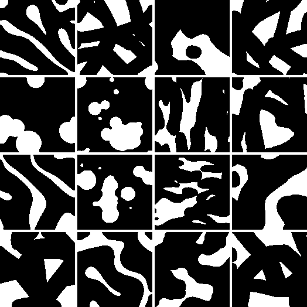

<p align="center">
  
</p>

# GenTO-Unified-generative-design-of-architected-metamaterials

[](https://doi.org/10.5281/zenodo.20452109)

Generative Topology Optimization Design (GenTO): a diffusion-based framework that learns reusable topology priors from large metamaterial datasets and steers them toward task-specific objectives for thermal, morphology, elasticity, and vibration transmission design.

## Overview

GenTO treats topology knowledge as a reusable design prior. A diffusion model is first trained on large 2D metamaterial topology datasets, and the pretrained model is then adapted to different design tasks through iterative generation, evaluation, selection, and fine-tuning. The same pretrained topology prior can be reused across heterogeneous objectives and constraints.

This repository contains the code for:

- Packing and loading binary topology datasets
- Training the unconditional diffusion topology model
- Running generation-based optimisation examples
- Running a lightweight toy target-matching example in `Generation/F0_TOY`
- Evaluating task-specific objectives for heat conduction, morphology, elasticity, and vibration transmission

## Repository Structure

```text
.
├── Training/
│   ├── train.py
│   ├── data_aggregation.py
│   ├── model/
│   └── Binary_Image_Packed/
└── Generation/
    ├── F0_TOY/
    ├── F1_HE/
    ├── F2_MO/
    ├── F3_ES/
    ├── F4_FQ/
    └── models/
```

`Training/` contains dataset loading and diffusion-model training code.

`Generation/` contains pretrained-model-based optimisation examples and task valuers.

Please see the README files inside `Training/` and `Generation/` for folder-specific instructions.

## Checkpoints and Data

Pretrained checkpoints and packed training datasets are not included in this GitHub repository because of file-size limits.

They can be downloaded from Google Drive:

https://drive.google.com/drive/folders/1iLriVSi7aBi89xtdFyk8-OWidYB0o3ys?usp=drive_link

They are also archived on Zenodo:

https://doi.org/10.5281/zenodo.20452173

The data/checkpoint archive contains:

- `Binary_Image_Packed`: the full packed topology dataset used for model training.
- `Binary_Image_Packed_small`: a lightweight sample dataset for quick testing and code verification.
- `model_ckpt_pretrained`: pretrained diffusion model checkpoints for periodic, four-fold symmetric, and eight-fold symmetric topology priors.

After downloading, place the files in the following folders:

```text
Generation/models/model_ckpt_pretrained/
Training/Binary_Image_Packed/
```

## Main Requirements

The code was tested with:

```text
Python 3.11.6
PyTorch 2.9.1+cu130
NumPy 2.3.5
SciPy 1.16.3
Matplotlib 3.10.6
scikit-image 0.25.2
tqdm 4.67.1
```

PyTorch is the main dependency. A CUDA-enabled PyTorch installation is recommended for generation and training.

## Quick Start

The easiest way to get started is to run the lightweight toy example in `Generation/F0_TOY`.

This toy model demonstrates the core GenTO workflow on a simple target-matching problem: a pretrained toy diffusion model generates binary unit-cell topologies, a short pixel-matching valuer scores how close each candidate is to a target `G` pattern, and the model is iteratively fine-tuned toward better samples. It is designed for quick testing and visualization rather than physical benchmarking.

<p align="center">
  
</p>

Run the toy example:

```bash
cd Generation/F0_TOY
python Djob_TOY.py
```

## Training and Generation Examples

Train a diffusion model:

```bash
cd Training
python train.py
```

Run a generation example:

```bash
cd Generation/F1_HE
python Djob_HE_max.py
```

Other generation examples are available in:

```text
Generation/F0_TOY/
Generation/F2_MO/
Generation/F3_ES/
Generation/F4_FQ/
```

## Authors

Haolin Li and Yuyang Miao

## Citation

If you use this code, please cite the Zenodo record:

```text
https://doi.org/10.5281/zenodo.20452109
```
